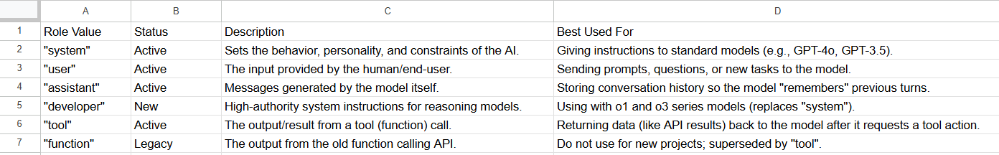
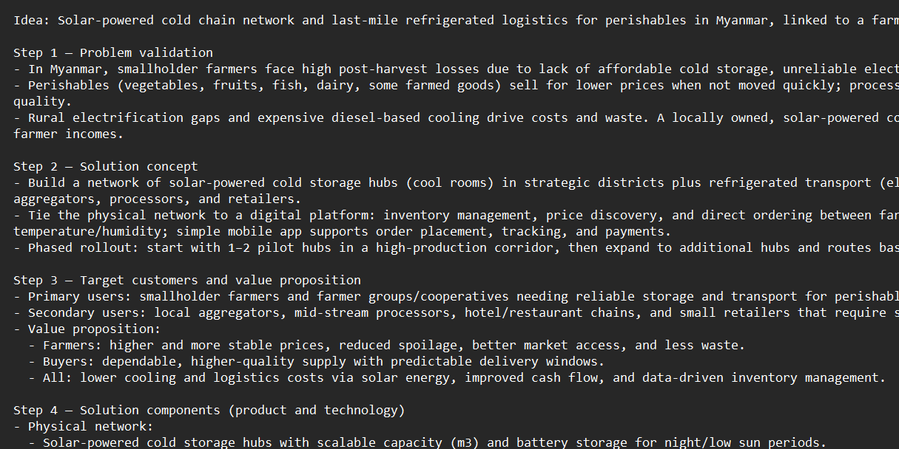
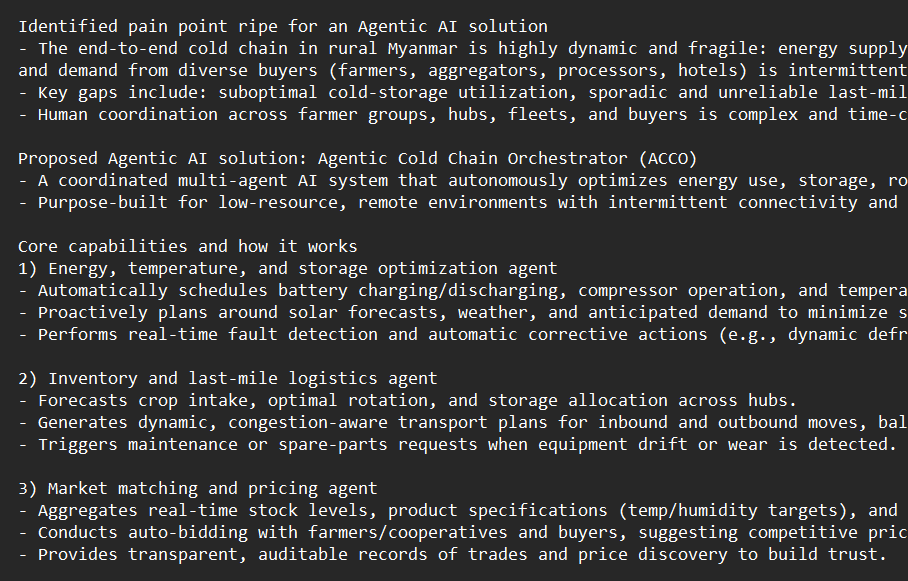

# Context Chaining
[FULL CODE](context_chaining.py)

## Purpose
**Context Chaining** fundmental concept ဖြစ်ပါတယ်<br><br>
*Context*: မြန်မာလို 'စကားစပ်'လို့ အဓိပ္ပာယ်ရပါတယ်<br>
မိမိနဲ့ လူတစ်ယောက် အကြောင်းအရာတစ်ခုကို ဆွေးနွေးနေတယ်ဆိုပါစို့<br>
ဥပမာ "ဆီကားတွေက ဘယ်လိုကောင်းကြောင်း EV တွေကလည်း ဘယ်လိုကောင်းကြောင်း" တစ်ယောက်နဲ့ တစ်ယောက် ဆွေးနွေးပြောဆိုနေကြတယ်ဆိုပါတော့<br>
မိမိက ဒီအကြောင်းအရာကို ပြောပြီးတဲ့အချိန် တစ်ဖက်လူကလည်း ဒီအကြောင်းအရာနဲ့ ဆက်စပ်တဲ့ စကားကိုပဲပြန်ပြောမှာဖြစ်ပါတယ်<br>
တစ်ဖက်လူက "EV ကားတွေကတော့ နောင်တစ်ချိန်မှာ တော်တော်အသုံးများလာမှာကွ"လို့ပြောလိုက်တဲ့အချိန်မှာ<br>မိမိက "ငါဒီနေ့ ငါးဟင်းနဲ့ ထမင်းစားပြီးပြီ"လို့ ပြောလိုက်ရင် တစ်ဖက်လူက ကြောင်သွားမှာပေ့ါ<br>
အဲ့ဒါကို စကားအဆက်အစပ်လွတ်သွားတယ်လို့ခေါ်ပါတယ်
တစ်ဖက်က "EV ကား" အကြောင်းပြောနေတဲ့အချိန် ကိုယ်ကလည်း အဲ့ဒါနဲ့ဆက်စပ်တဲ့ စကားကိုပြန်ပြောရမှာဖြစ်ပါတယ်<br>
ဒါကိုပဲ 'Context' လို့ သုံးနှုန်းတာဖြစ်ပါတယ်<br>


## Use Case
ဒီသင်ခန်းစာမှာတော့ AI တွေနဲ့ မိမိ(programming အရ)စကားပြောဆိုတဲ့အခါမှာ စကားအဆက်အစပ် မလွတ်သွားအောင် (အဆက်အစပ်ရှိနေအောင်) ဘယ်လို လက်ဆင့်ကမ်းသွားရမလဲဆိုတာ လေ့လာရမယ့် basic သင်ခန်းစာတစ်ခုဖြစ်ပါတယ်<br>

Essential Lesson တစ်ခုဖြစ်လို့ ကျော်လို့မရပါဘူး<br>
Complex Agent တွေရဲ့ First step တစ်ခုလို့ပြောလည်း မှန်ပါတယ်<br>


## Why We Use It
- prompt တစ်ခုတည်းနဲ့ မလုံလောက်တဲ့အခါ (သို့မဟုတ်) ရလာတဲ့ resultကို တဖန်စစ်ထုတ်ချင်တဲ့အခါ(filtering) တွေမှာ သုံးတာဖြစ်ပါတယ်
- (တစ်နည်း) အရမ်းကောင်းမွန်တိကျတဲ့ အဖြေတစ်ခုကိုလိုချင်တဲ့အချိန်မှာလည်းသုံးနိုင်ပါတယ်
- (တစ်နည်း) ပြဿနာတစ်ခုကို ရှာခိုင်းပြီး ထိုပြဿနာကို ထပ်မံ ဖြေရှင်းခိုင်းတဲ့အခါမှာလည်းသုံးပါတယ်
- and so on...
---

## Set ENV
Code ကို runနိုင်ဖို့အတွက် ပထမဦးဆုံး Environment setup လုပ်ထားဖို့လိုအပ်ပါတယ်

**Step 1:**
Project root folder ထဲမှာ `.env` ဆိုတဲ့ file name နဲ့ file အသစ်တစ်ခုဆောက်ပါ

**Step 2:**
`.env` file ထဲမှာ အောက်ပါအတိုင်း မိမိရဲ့ OpenAI API key ကိုထည့်ပါ

```env
OPENAI_API_KEY=sk-proj-xxxxxxxxxxxxxxxxxxxxxxxx
```

> **Note**: `sk-proj-xxxxxxxxxxxxxxxxxxxxxxxx` နေရာမှာ မိမိရဲ့ ကိုယ်ပိုင် API key ကို [OpenAI Platform](https://platform.openai.com/api-keys) ကနေ copy ယူပြီး ထည့်ပေးရမှာဖြစ်ပါတယ်<br>
*minimum 5$ လောက်ကုန်ကျမှာ ဖြစ်ပါတယ်*


## Code Explanation

### 1. Imports and Setup
```python
from dotenv import load_dotenv
import os
from openai import OpenAI
import time

load_dotenv(override=True)

openai_api_key = os.getenv("OPENAI_API_KEY")
```
- **dotenv**: `.env` fileထဲက OPENAI_API_KEY ကို ဆွဲယူပေးပါတယ်
- **os**:  ဆွဲယူပြီး KEY ကို ပြန်လည်အသုံးချလို့ရအောင် ဆွဲထုတ်ပေးပါတယ်
- **OpenAI**: OpenAI SDK နဲ့ API call အတွက် moduleဖြစ်ပါတယ်
- **time**: ကိုယ်သုံးလိုက်တဲ့ model တစ်ခုဘယ်လောက်ကြာသလဲ timerမှတ်ဖို့အတွက်ပါ

### 2. Environment Verification
```python
if openai_api_key:
    print(f"YEAH, API KEY FOUND START WITH '{openai_api_key[:8]}'")
else:
    print("NO KEY FOUND.")

openai = OpenAI()
```
- **api key** ရှိနေလားစစ်ပေးတဲ့ code block ပါ
- `openai_api_key[:8]`: Key ရှိနေခဲ့ရင် ပထမဆုံး ရှစ်လုံးကို printထုတ်ပေးတာဖြစ်ပါတယ်

### 3. First Link in the Chain (Idea Generation)
```python
# --- First API call and File Write ---
start_time_1 = time.time() 

question1 = "Pick a business idea that might be worth exploring in Myanmar. Explore deep dive step by step."

message_params = [{
    "role": "user",
    "content": f"{question1}, no more continue for the chat. Don't continue conversation after the answer."
}]

response1 = openai.chat.completions.create(
    model="gpt-5-nano",
    messages=message_params
).choices[0].message.content
```
**__First API call and File Write__**<br> 
- ပထမဆုံး API call
- question ဆိုတဲ့ မေးချင်တဲ့မေးခွန်းပါမယ်
- api call ဖို့အတွက် required* parametersတွေထည့်ပေးရပါမယ်<br>
parameters ထဲက keyဖြစ်တဲ့ `role`အတွက် value နေရာမှာ openai က သတ်မှတ်ထားတဲ့ fixed string ထည့်ရမှာပါ<br>
example:

- sdk ကနေ သုံးတာဖြစ်တဲ့အတွက် base_url မပါလာပါဘူး<br>
`openai.chat.completions.create()`နဲ့ `https://api.openai.com/v1/chat/completions` connect လုပ်ပေးထားတာဖြစ်ပါတယ်<br>
- `question`: မြန်မာနိုင်ငံမှာ ဘယ်လိုစီးပွားလုပ်တာအဆင်ပြေမလဲလို့ မေးထားတာဖြစ်ပါတယ်
- `model`: ကြိုက်တဲ့ modelကိုကြိုက်သလို ယှဥ်ပြီးသုံးကြည့်လို့ရပါတယ်<br>
model parameters တွေကို [ဒီမှာ](https://platform.openai.com/docs/pricing)ကြည့်ပါ
- `choices[0].message.content`: api response က jsonနဲ့လာတာဖြစ်ပြီး အနည်းငယ်ရှုပ်ပါတယ် .. အဲ့ responseထဲကမှ gpt-5-nano reply ပြန်လာတဲ့ စာပိုဒ် သီးသန့်ကိုပဲ ပြန်ယူထားတာပါ<br>အကျယ်ကြည့်ချင်ရင် `print(choices)`လို့ ကြည့်နိုင်ပါတယ်


### 4. Saving Intermediate State
```python
with open("business_idea.txt", "w", encoding="utf-8") as file:
    file.write(response1)
    print("done finding business!\nProcessing to next answer...")

end_time_1 = time.time()
duration_1 = end_time_1 - start_time_1
```
- ရလာတဲ့ result ကို text file တစ်ခုအဖြစ်ထုတ်ပြီး သိမ်းထားတာဖြစ်ပါတယ်
- gpt-5-nano model ရဲ့ ကြာချိန်ကိုမှတ်ထားတဲ့ timerတစ်ခုလည်းပါပါတယ်
- Example(business_idea.txt):


### 5. Second Link in the Chain (Analysis & Solution)
**Context Chaining ရဲ့ အရေးအကြီးဆုံးအပိုင်း**
```python
# --- Second API call ---
start_time_2 = time.time()

question2 = f"Read the idea below and search for the pain point in that industry and solve with something challenging that might be ripe for solution. {response1}"

message_params2 = [{
    "role": "user",
    "content": f"{question2}, no more continue for the chat. don't continue conversation after the answer."
}]

response2 = openai.chat.completions.create(
    model="gpt-5-nano",
    messages=message_params2
).choices[0].message.content

with open("pain_point_&_solution.txt", "w", encoding="utf-8") as file:
    file.write(response2)
    print("done finding solution")
```
- First API call ကရလာတဲ့ `response1`ကို `question2`ထဲကိုထည့်လိုက်ပါတယ်
- `question2` အဓိပ္ပါယ်ကတော့ ရလာတဲ့ business ideaမှာ ဘယ်ဟာက problem ဖြစ်ပြီး ဒီအတွက် ဘာက solution ဖြစ်မလဲဆိုတာအဖြေထုတ်ခိုင်းတာပါ
- code run ပြီးဖတ်ကြည့်လိုက်ရင် ပိုရှင်းသွားပါလိမ့်မယ်
- ပထမ API call မှာ idea ထုတ်ခိုင်းတယ် ၊  အခု API callမှာ အဲ့ ideaကို အသုံးပြုပြီး pain point နဲ့ solution ကိုဆက်ထုတ်ခိုင်းတာပါ
- Example(pain_point_&_solution.txt):


### 6. Performance Metrics
```python
# --- Results Output ---
total_duration = duration_1 + duration_2

print("\n--- Durations ---")
print(f"first_call: {duration_1:.2f} seconds")
print(f"second_call: {duration_2:.2f} seconds")
print(f"Total Combined Duration: {total_duration:.2f} seconds")
```
- ဒါက အပို အပိုင်းလေးပါ
- ကြာချိန်ကို တွက်ထားတာဖြစ်ပါတယ်
- model တွေရဲ့ စွမ်းဆောင်ရည်မတူတဲ့အတွက် ဘယ် modelက အချိန်ဘယ်လောက်ယူမလဲဆိုတာ<br>ပျှမ်းမျှအားဖြင့်သိသွားစေပါတယ်
- ဒါကြောင့် ကိုယ်က မြန်မြန်သုံးချင်ရင် ဘယ် model,<br>
အချိန်ကုန်ရင် ကုန်ပါစေ .. ပိုပြီး reasoning ဖြစ်ချင်ရင် ဘယ် modelအစရှိသဖြင့် သိသွားစေမှာပါ

## [Back to Menu](../README.md)
